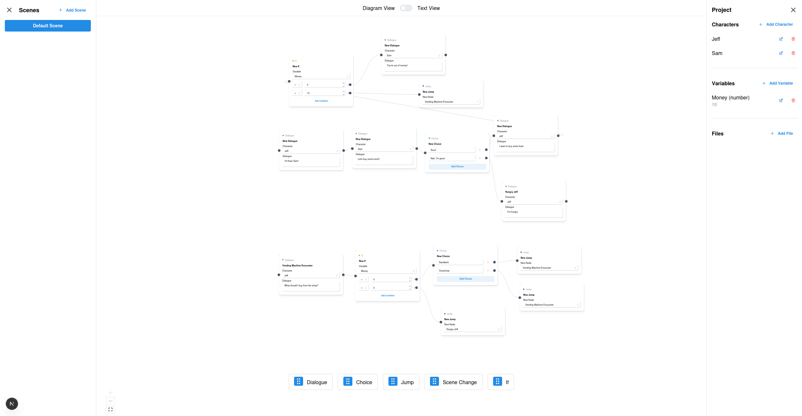
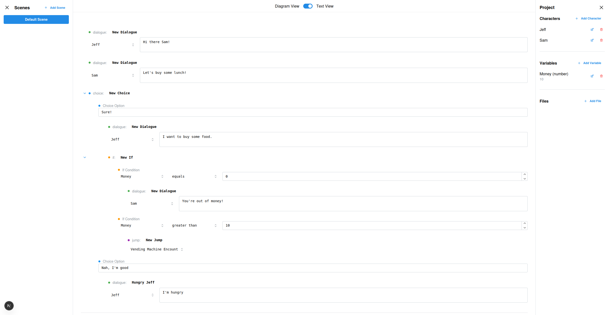

# Dialogue Tree Editor

Design branching dialogue and event logic visually or in plain text.
Switch between Diagram Mode for intuitive node editing and Text Mode for fast keyboard-based writing.

## Diagram Mode

## Text Mode
